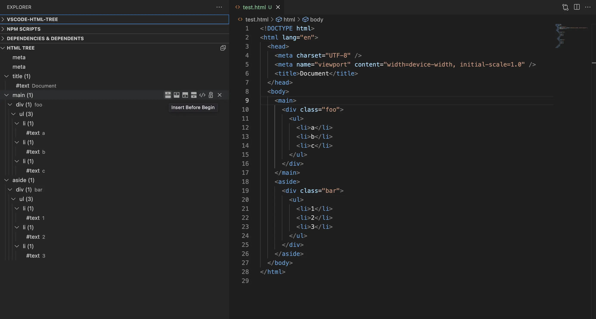
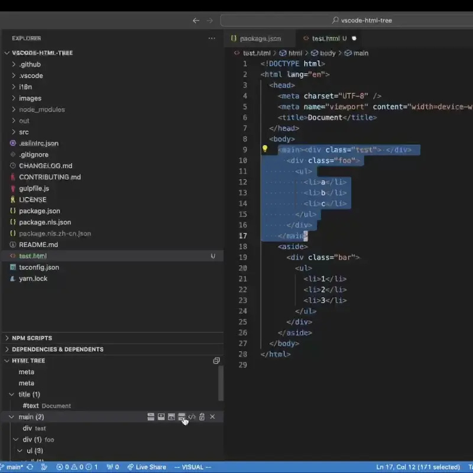
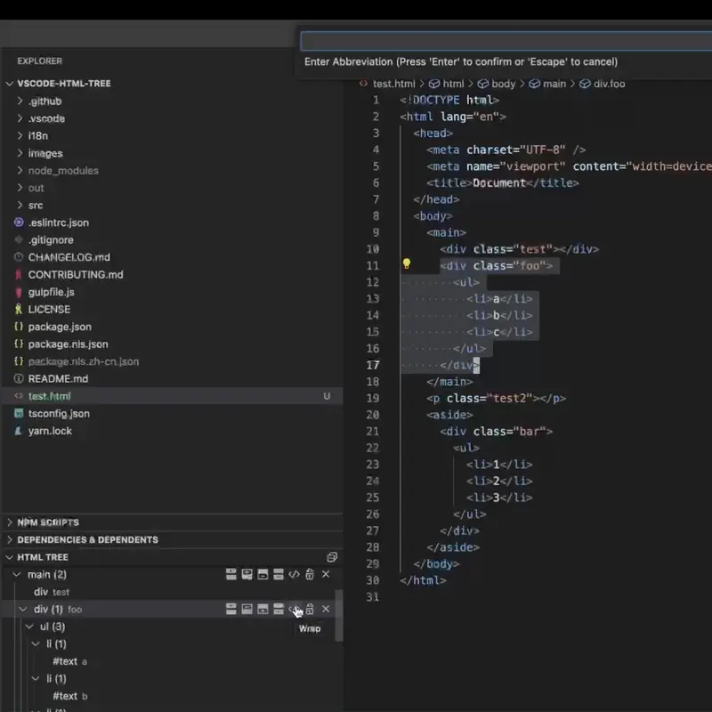
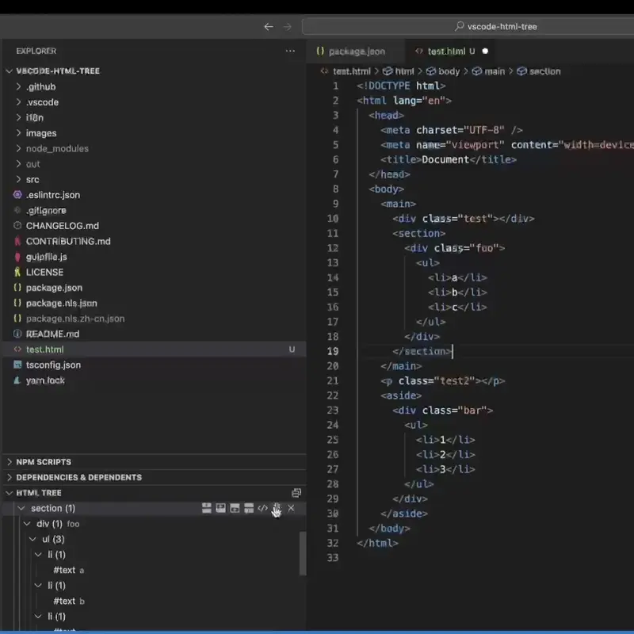
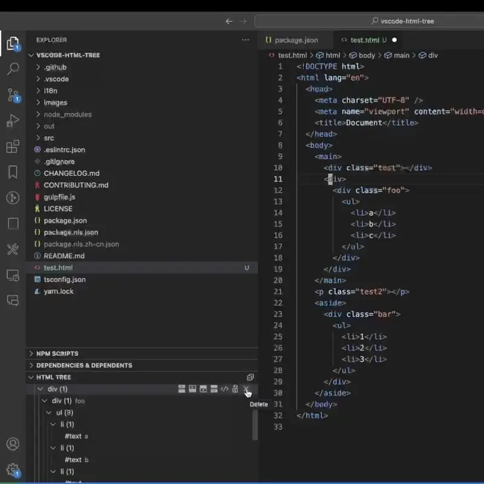

# vscode-html-tree

Edit HTML quickly, also support Vue and Angular.



## Features

### Insert elements

Support insert elements `beforebegin`, `afterbegin`, `beforeend`, `afterend`.



### Wrap elements.



### Rename elements.



### Remove elements and retain children.



## Install via CLI

```bash
code --install-extension zjffun.html-tree
```

## TODO

- [ ] Support React (JSX).

## [Release Notes](./CHANGELOG.md)

## [Contribute](./CONTRIBUTING.md)
